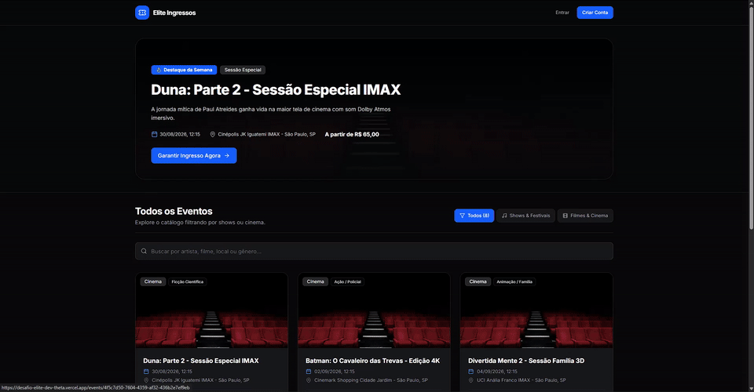
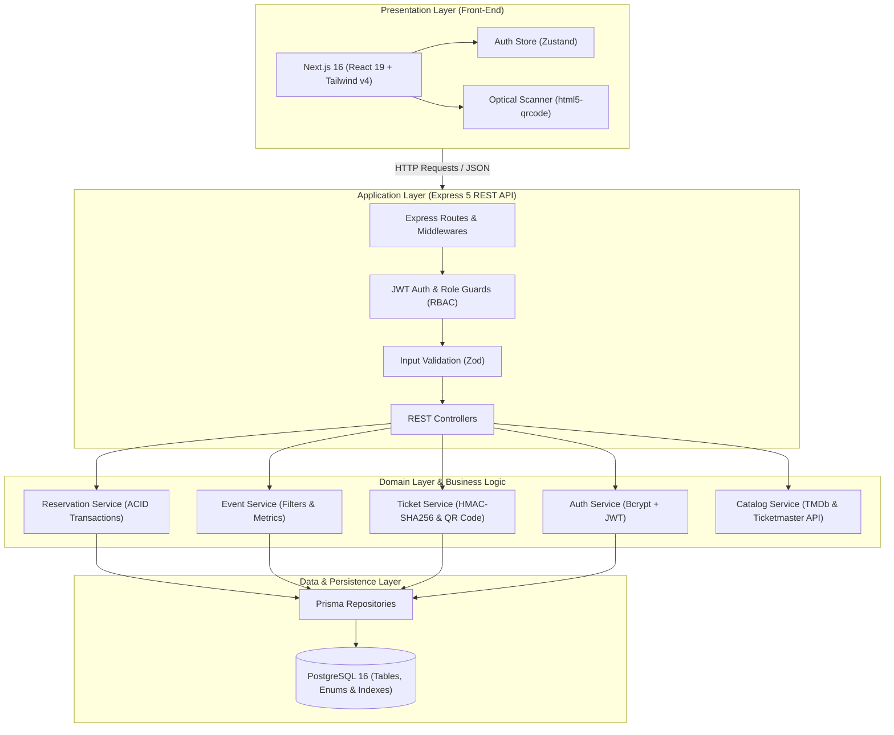
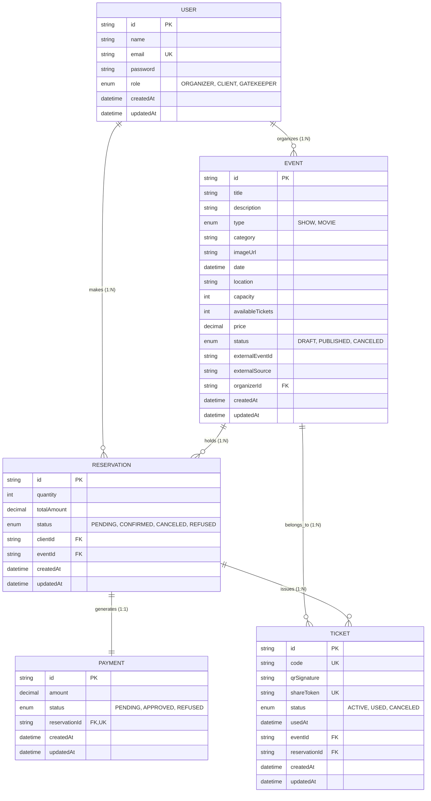

# 🎟️ Elite Ingressos — Event Management & Digital Ticketing Platform

[](https://www.typescriptlang.org/)
[](https://nextjs.org/)
[](https://react.dev/)
[](https://expressjs.com/)
[](https://www.postgresql.org/)
[](https://www.prisma.io/)
[](https://tailwindcss.com/)
[](https://www.docker.com/)
[](https://vitest.dev/)

> 🇺🇸 **English** | 🇧🇷 [**Versão em Português**](README.md)

High-reliability Full-Stack solution for purchasing, managing, issuing, canceling, and validating in real-time tickets for Concerts and Movies. The system features strict concurrency control with ACID transactions (Zero Overbooking), cryptographic HMAC-SHA256 digital signature anti-fraud in QR Codes, secure sharing of proof-of-ownership, and intelligent integration with external catalogs (TMDb and Ticketmaster).

## 📌 Quick Navigation

- [📝 About the Project](#-about-the-project)
- [🖼️ Preview](#️-preview)
- [🌐 Application Deployment](#-application-deployment)
- [⚡ API Endpoints](#-api-endpoints)
- [✨ Key Features](#-key-features)
- [🛠️ Technologies & Tools Used](#️-technologies--tools-used)
- [🏛️ Solution Architecture](#️-solution-architecture)
- [📁 Repository Structure](#-repository-structure)
- [💡 Technical Decisions](#-technical-decisions)
- [🚀 How to Run the Project](#-how-to-run-the-project)

## 📝 About the Project

**Elite Ingressos** was designed and built as an engineering solution for the **Verzel Elite Dev Technical Challenge**. Its core purpose is to deliver a modern, resilient, and secure platform for the digital ticketing and entertainment ecosystem.

The application addresses critical challenges in modern software engineering:
- **Inventory Consistency**: Mathematical and transactional guarantee against overselling (*overbooking*) under high-concurrency conditions.
- **Security & Anti-Fraud**: QR Codes generated with HMAC-SHA256 cryptographically signed payloads, verified via constant-time equality (`crypto.timingSafeEqual`) to eliminate timing-attack vulnerabilities.
- **Privacy & Asset Protection**: Public ticket sharing via tokenized UUID links that allow proving attendance without leaking private cryptographic material or gate admission codes (*Zero Cryptographic Leakage*).
- **Smooth Gate Operations**: Real-time validation module supporting optical scanning via camera and resilient manual code entry.

## 🖼️ Preview



## 🌐 Application Deployment

Access the live application in production:
👉 **[Elite Ingressos](https://desafio-elite-dev-theta.vercel.app/)**

> ⚠️ **Cold Start Notice**: The front-end is hosted on Vercel and the back-end on Render.com free tier. Due to container idle sleep mode, the first request may take around 50 seconds to wake up. Subsequent requests respond immediately.

### 👥 Seeded Test Accounts

| Role | Name | E-mail | Password | Permissions / Access |
| :--- | :--- | :--- | :--- | :--- |
| **👑 ORGANIZER** | Carlos Organizador | `organizador@eliteingressos.com` | `123456` | Create/manage events, sales analytics, TMDb/Ticketmaster wizard |
| **👤 CLIENT** | Ana Cliente | `cliente1@eliteingressos.com` | `123456` | Buy tickets, cancel orders, view QR Codes, share attendance vouchers |
| **👤 CLIENT** | Bruno Cliente | `cliente2@eliteingressos.com` | `123456` | Secondary account for concurrency and simultaneous purchase tests |
| **🚪 GATEKEEPER** | Roberto Portaria | `portaria@eliteingressos.com` | `123456` | Gate ticket validation (Live Camera and manual code input) |

## ⚡ API Endpoints

The API follows RESTful architecture with standardized JSON responses and centralized error handling.

### 🔐 Authentication (`/api/auth`)
| Method | Endpoint | Protection | Description |
| :--- | :--- | :--- | :--- |
| `POST` | `/api/auth/register` | Public | Registers a new user (`ORGANIZER`, `CLIENT`, `GATEKEEPER`) |
| `POST` | `/api/auth/login` | Public | Authenticates credentials and returns a Bearer JWT |
| `GET` | `/api/auth/me` | Authenticated | Returns profile data of the logged-in user |

### 🌐 External Catalog (`/api/catalog`)
| Method | Endpoint | Protection | Description |
| :--- | :--- | :--- | :--- |
| `GET` | `/api/catalog/search` | `ORGANIZER` | Queries movies/concerts on TMDb and Ticketmaster with fallback |

### 🎭 Events (`/api/events`)
| Method | Endpoint | Protection | Description |
| :--- | :--- | :--- | :--- |
| `GET` | `/api/events` | Public | Lists published events with search, type filters, and pagination |
| `GET` | `/api/events/:id` | Public | Returns complete details for a specific event |
| `GET` | `/api/events/organizer/my-events` | `ORGANIZER` | Lists all events created by the logged-in organizer with metrics |
| `POST` | `/api/events` | `ORGANIZER` | Creates a new event in the system |
| `PUT` | `/api/events/:id` | `ORGANIZER` | Updates an existing event owned by the organizer |

### 💳 Reservations, Payment & Cancellation (`/api/reservations`)
| Method | Endpoint | Protection | Description |
| :--- | :--- | :--- | :--- |
| `POST` | `/api/reservations` | `CLIENT` | Places reservation in atomic transaction with simulated payment (`APPROVED`/`REFUSED`) |
| `GET` | `/api/reservations/my-reservations` | `CLIENT` | Returns order history and statuses for the client |
| `GET` | `/api/reservations/:id` | `CLIENT` | Retrieves details of a specific reservation |
| `PATCH` | `/api/reservations/:id/cancel` | `CLIENT` | Cancels confirmed order, restores seats to inventory, and revokes tickets |

### 🎟️ Tickets, Sharing & Gatekeeping (`/api/tickets`)
| Method | Endpoint | Protection | Description |
| :--- | :--- | :--- | :--- |
| `GET` | `/api/tickets/my-tickets` | `CLIENT` | Lists active tickets for client with Base64 Data URL QR Codes |
| `GET` | `/api/tickets/share/:shareToken` | Public | Safe public attendance proof check (without exposing secrets) |
| `POST` | `/api/tickets/validate` | `GATEKEEPER` | Validates ticket at entrance via camera or manual entry |

## ✨ Key Features

- 🛡️ **Zero Overbooking Guarantee**: Purchase and cancellation operations run inside PostgreSQL atomic transactions (`prisma.$transaction`) with database-level capacity validation.
- 🔄 **Atomic Cancellation & Inventory Rollback**: Buyers can cancel confirmed orders, releasing seats back to inventory and rendering canceled tickets in disabled grayscale.
- 🔐 **Cryptographic Anti-Fraud**: HMAC-SHA256 signatures embedded directly into the QR Code payload and constant-time checks prevent forging or tampering.
- 🔗 **Zero Cryptographic Leakage Public Sharing**: Dedicated UUID public link creates an attendance confirmation voucher without exposing admission secrets or QR Codes.
- 🌐 **Intelligent External Catalog**: Live auto-fill integration with **TMDb (The Movie Database)** and **Ticketmaster Discovery** APIs with robust fallback mechanisms.
- 🚪 **Gatekeeper Entrance Scanner**: Real-time camera optical decoder via `html5-qrcode` alongside manual code entry, providing explicit diagnostics (`VALID`, `ALREADY_USED`, `WRONG_EVENT`, `INVALID`, `CANCELED`).
- 🎨 **Modern & Accessible Design System**: Built with Next.js 16 and TailwindCSS v4, featuring dot-indicator semantic status badges and responsive layouts.

## 🛠️ Technologies & Tools Used

| Layer / Purpose | Technology | Description |
| :--- | :--- | :--- |
| **Core Language** | **TypeScript 5.8** | Compile-time static typing across the full stack |
| **Front-End Framework** | **Next.js 16 (App Router)** | Hybrid rendering and modern server/client component routing |
| **UI Library** | **React 19** | Modern UI primitives with functional components and hooks |
| **Styling** | **TailwindCSS 4** | High-performance CSS utility engine with custom design system |
| **Global State** | **Zustand 5** | Lightweight and reactive client state with LocalStorage persistence |
| **Back-End Framework** | **Express 5** | Robust REST HTTP framework with native async handler support |
| **Data Persistence** | **Prisma ORM 7** | Declarative data modeling, static typing, and ACID transactions |
| **Database** | **PostgreSQL 16** | Relational database with native Enums and indexed queries |
| **Auth & Cryptography** | **JWT & HMAC-SHA256** | Bearer Token authentication and cryptographic QR signatures |
| **Schema Validation** | **Zod 4** | Declarative runtime validation with TypeScript type inference |
| **HTTP Security** | **Helmet & CORS** | Standard OWASP headers and cross-origin security controls |
| **QR Code Engine** | **html5-qrcode** | Real-time optical barcode/QR decoding via browser camera |
| **Automated Testing** | **Vitest 4 + RTL + Supertest** | Comprehensive test suite covering business logic, contracts, and UI |
| **Containerization** | **Docker & Docker Compose** | Reproducible, isolated environment for local development |

## 🏛️ Solution Architecture

The application is structured into decoupled layers with single responsibility principles, isolating UI presentation, REST controllers, business services, and database persistence.


```mermaid
flowchart TD
    subgraph ClientLayer ["Presentation Layer (Front-End)"]
        UI["Next.js 16 (React 19 + Tailwind v4)"]
        State["Auth Store (Zustand)"]
        Scanner["Optical Scanner (html5-qrcode)"]
        UI --> State
        UI --> Scanner
    end

    subgraph APILayer ["Application Layer (Express 5 REST API)"]
        Router["Express Routes & Middlewares"]
        AuthGuard["JWT Auth & Role Guards (RBAC)"]
        Validator["Input Validation (Zod)"]
        Controller["REST Controllers"]
        
        Router --> AuthGuard --> Validator --> Controller
    end

    subgraph DomainLayer ["Domain Layer & Business Logic"]
        AuthService["Auth Service (Bcrypt + JWT)"]
        EventService["Event Service (Filters & Metrics)"]
        ReservationService["Reservation Service (ACID Transactions)"]
        TicketService["Ticket Service (HMAC-SHA256 & QR Code)"]
        CatalogService["Catalog Service (TMDb & Ticketmaster API)"]
        
        Controller --> AuthService
        Controller --> EventService
        Controller --> ReservationService
        Controller --> TicketService
        Controller --> CatalogService
    end

    subgraph DataLayer ["Data & Persistence Layer"]
        PrismaRepo["Prisma Repositories"]
        Postgres[("PostgreSQL 16 (Tables, Enums & Indexes)")]
        
        ReservationService --> PrismaRepo
        EventService --> PrismaRepo
        TicketService --> PrismaRepo
        AuthService --> PrismaRepo
        PrismaRepo --> Postgres
    end

    ClientLayer -->|HTTP Requests / JSON| APILayer
```

### Entity-Relationship Diagram (ERD)


```mermaid
erDiagram
    USER ||--o{ EVENT : "organizes (1:N)"
    USER ||--o{ RESERVATION : "makes (1:N)"
    EVENT ||--o{ RESERVATION : "holds (1:N)"
    EVENT ||--o{ TICKET : "belongs_to (1:N)"
    RESERVATION ||--|| PAYMENT : "generates (1:1)"
    RESERVATION ||--o{ TICKET : "issues (1:N)"

    USER {
        string id PK
        string name
        string email UK
        string password
        enum role "ORGANIZER, CLIENT, GATEKEEPER"
        datetime createdAt
        datetime updatedAt
    }

    EVENT {
        string id PK
        string title
        string description
        enum type "SHOW, MOVIE"
        string category
        string imageUrl
        datetime date
        string location
        int capacity
        int availableTickets
        decimal price
        enum status "DRAFT, PUBLISHED, CANCELED"
        string externalEventId
        string externalSource
        string organizerId FK
        datetime createdAt
        datetime updatedAt
    }

    RESERVATION {
        string id PK
        int quantity
        decimal totalAmount
        enum status "PENDING, CONFIRMED, CANCELED, REFUSED"
        string clientId FK
        string eventId FK
        datetime createdAt
        datetime updatedAt
    }

    PAYMENT {
        string id PK
        decimal amount
        enum status "PENDING, APPROVED, REFUSED"
        string reservationId FK,UK
        datetime createdAt
        datetime updatedAt
    }

    TICKET {
        string id PK
        string code UK
        string qrSignature
        string shareToken UK
        enum status "ACTIVE, USED, CANCELED"
        datetime usedAt
        string eventId FK
        string reservationId FK
        datetime createdAt
        datetime updatedAt
    }
```

## 📁 Repository Structure

```text
desafio-elite-dev/
├── backend/
│   ├── prisma/
│   │   ├── schema.prisma           # Relational schema, Enums, and models
│   │   └── seed.ts                 # Database seeding with 4 users and 8 events
│   ├── src/
│   │   ├── config/                 # Environment variables and Prisma Client
│   │   ├── controllers/            # REST route controllers
│   │   ├── middlewares/            # JWT Auth, RBAC, Zod validation, error handlers
│   │   ├── repositories/           # Isolated queries and Prisma transactions
│   │   ├── routes/                 # Domain-segmented REST route definitions
│   │   ├── schemas/                # Zod validation schemas
│   │   ├── services/               # Business logic, HMAC signing, transactions, catalogs
│   │   ├── utils/                  # Encryption, error handling, helpers
│   │   ├── app.ts                  # Express setup, Middlewares, and CORS
│   │   └── server.ts               # HTTP server entry point
│   ├── tests/                      # Integration, unit, and contract tests
│   ├── docker-compose.yml          # PostgreSQL 16 container definition
│   └── package.json
├── frontend/
│   ├── src/
│   │   ├── app/                    # Pages & routing (Next.js App Router)
│   │   │   ├── page.tsx            # Public showcase with search and filters
│   │   │   ├── login/              # 1-click test credentials login
│   │   │   ├── register/           # Role-based user registration
│   │   │   ├── events/[id]/        # Event detail & checkout modal
│   │   │   ├── my-tickets/         # Client ticket wallet with QR Codes
│   │   │   ├── my-reservations/    # Order history & cancellation modal
│   │   │   ├── tickets/share/      # Safe tokenized public voucher
│   │   │   ├── organizer/          # Event management & TMDb/Ticketmaster wizard
│   │   │   └── gatekeeper/         # Live camera & code gate validation
│   │   ├── components/             # Layout components and reusable UI elements
│   │   ├── services/               # HTTP client with JWT interceptor
│   │   ├── stores/                 # Global auth state with Zustand
│   │   ├── types/                  # Shared TypeScript types
│   │   └── utils/                  # Formatters and styling helpers
│   ├── __tests__/                  # Automated UI component tests
│   └── package.json
├── docs/                           # Supplementary flow and AI workflow documentation
├── README.md                       # Main documentation in Portuguese
└── README.en.md                    # English documentation
```

## 💡 Technical Decisions

Architecture decisions were driven by robustness, maintainability, and security:

1. **Zero-Overbooking Guarantee with ACID Transactions**: The reservation process leverages `$transaction` with strict conditional decrements on `availableTickets`, preventing race conditions during concurrent checkouts.
2. **HMAC-SHA256 Cryptography for Tickets**: Ticket authenticity is validated via server-side cryptographic signatures, preventing unauthorized ticket generation.
3. **Zero Cryptographic Leakage Public Sharing**: Attendance proof verification uses an isolated UUID token that strips admission codes and QR payload data, keeping entry credentials safe.
4. **Resilient External Catalog Integration**: The catalog service wraps external TMDb and Ticketmaster API calls with resilient error handling and automated fallback.
5. **Decoupled Layered Architecture**: Clean separation among Controllers, Services, and Repositories ensures high testability with mocks and independent database evolution.

> For in-depth technical decisions:
> - 📄 [Backend DECISIONS.md](./backend/DECISIONS.md)
> - 📄 [Frontend DECISIONS.md](./frontend/DECISIONS.md)
> - 📄 [AI Pair Programming Process](./docs/ai-workflow/AI_PAIR_PROGRAMMING.md)

## 🚀 How to Run the Project

### Prerequisites
- [Node.js](https://nodejs.org/) (v20 or higher)
- [Docker](https://www.docker.com/) and Docker Compose
- [Git](https://git-scm.com/)

### 1. Clone the Repository
```bash
git clone https://github.com/ludson96/desafio-elite-dev.git
cd desafio-elite-dev
```

### 2. Configure and Start the Back-End

1. Navigate to the backend directory:
   ```bash
   cd backend
   ```

2. Install dependencies:
   ```bash
   npm install
   ```

3. Set up environment variables:
   ```bash
   cp .env.example .env
   ```

4. Start the PostgreSQL database via Docker:
   ```bash
   docker compose up -d
   ```

5. Run Prisma migrations and seed database:
   ```bash
   npx prisma migrate dev
   npm run seed
   ```

6. Start the API development server:
   ```bash
   npm run dev
   ```
   The API will be available at `http://localhost:3001` (Healthcheck: `http://localhost:3001/health`).

### 3. Configure and Start the Front-End

1. Open a **new terminal** and navigate to the frontend directory:
   ```bash
   cd frontend
   ```

2. Install dependencies:
   ```bash
   npm install
   ```

3. Set up environment variables:
   ```bash
   cp .env.example .env.local
   ```

4. Start the Next.js development server:
   ```bash
   npm run dev
   ```
   Open **[http://localhost:3000](http://localhost:3000)** in your browser.

### 4. Running Automated Tests

The repository contains **42 automated tests** covering business logic, concurrency, security contracts, and components:

- **Run all monorepo tests**:
  ```bash
  npm test
  ```
- **Run Back-End tests (25 tests)**:
  ```bash
  cd backend && npm test
  ```
- **Run Front-End tests (17 tests)**:
  ```bash
  cd frontend && npm test
  ```

<div align="center">
  Developed by <strong>Ludson Pereira dos Santos</strong> 🚀<br />
  <a href="https://www.linkedin.com/in/ludson96/">LinkedIn</a> • <a href="https://github.com/ludson96">GitHub</a> • <a href="mailto:ludson_ps27@hotmail.com">E-mail</a>
</div>
