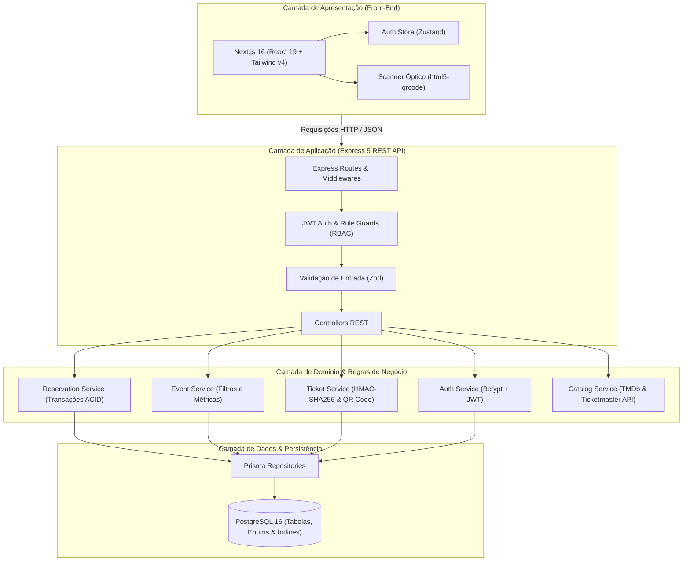
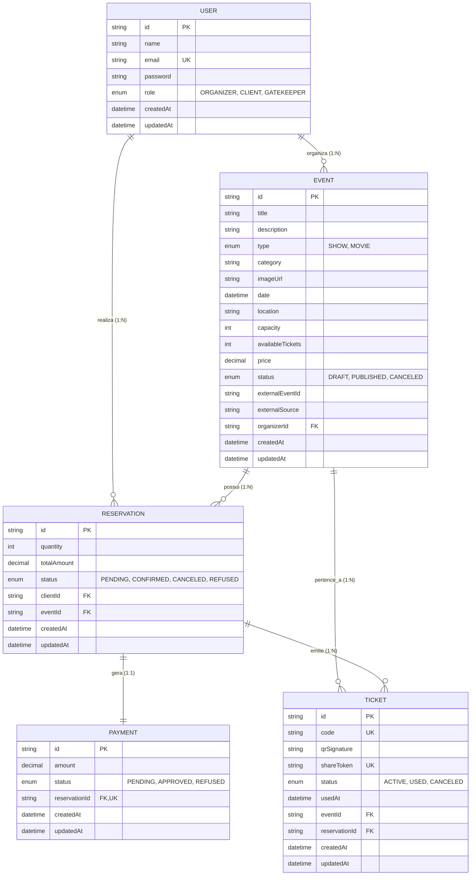

# 🎟️ Elite Ingressos — Plataforma de Eventos e Ingressos Digitais

[](https://www.typescriptlang.org/)
[](https://nextjs.org/)
[](https://react.dev/)
[](https://expressjs.com/)
[](https://www.postgresql.org/)
[](https://www.prisma.io/)
[](https://tailwindcss.com/)
[](https://www.docker.com/)
[](https://vitest.dev/)

> 🇧🇷 **Português** | 🇺🇸 [**English Version**](README.en.md)

Solução Full-Stack de alta confiabilidade para compra, gestão, emissão, cancelamento e validação em tempo real de ingressos para Shows e Cinema. O sistema conta com controle estrito de concorrência com transações ACID (Zero Overbooking), assinatura digital criptográfica HMAC-SHA256 anti-fraude em QR Codes, compartilhamento seguro de comprovante de titularidade e integração inteligente com catálogos externos (TMDb e Ticketmaster).

## 📌 Navegação Rápida

- [📝 Sobre o Projeto](#-sobre-o-projeto)
- [🖼️ Preview](#️-preview)
- [🌐 Deploy da Aplicação](#-deploy-da-aplicação)
- [⚡ API Endpoints](#-api-endpoints)
- [✨ Funcionalidades](#-funcionalidades)
- [🛠️ Tecnologias e Ferramentas Utilizadas](#️-tecnologias-e-ferramentas-utilizadas)
- [🏛️ Arquitetura da Solução](#️-arquitetura-da-solução)
- [📁 Estrutura do Repositório](#-estrutura-do-repositório)
- [💡 Decisões Técnicas](#-decisões-técnicas)
- [🚀 Como Executar o Projeto](#-como-executar-o-projeto)

## 📝 Sobre o Projeto

O **Elite Ingressos** foi concebido e desenvolvido como resposta técnica ao **Desafio Técnico Elite Dev da Verzel**. O objetivo central é fornecer uma plataforma moderna, resiliente e segura para o ecossistema de entretenimento e bilheteria digital.

A aplicação aborda desafios críticos da engenharia de software contemporânea:
- **Consistência de Estoque**: Garantia matemática e transacional contra vendas acima da capacidade (*overbooking*) sob alta concorrência de requisições simultâneas.
- **Segurança e Anti-Fraude**: QR Codes emitidos com payloads assinados criptograficamente em HMAC-SHA256 e validados com checagem em tempo constante (`crypto.timingSafeEqual`) para anular vulnerabilidades de *timing attacks*.
- **Privacidade e Proteção de Ativos**: Compartilhamento público de ingressos via links tokenizados com UUID dedicado, permitindo comprovação de presença sem vazar materiais criptográficos ou códigos que viabilizem clonagem na portaria (*Zero Cryptographic Leakage*).
- **Operação de Portaria Fluida**: Módulo para validação em tempo real utilizando leitura óptica por câmera e entrada manual resiliente.

## 🖼️ Preview


## 🌐 Deploy da Aplicação

Acesse a aplicação em produção:
👉 **[Elite Ingressos](https://desafio-elite-dev-theta.vercel.app/)**

> ⚠️ **Aviso de Cold Start**: O front-end está hospedado na Vercel e o back-end na camada gratuita do Render.com. Devido ao modo de suspensão de instâncias inativas, a primeira requisição pode levar cerca de 50 segundos para inicializar o container. As requisições seguintes ocorrem com resposta imediata.

### 👥 Contas Semeadas para Testes (Seed)

| Perfil | Nome | E-mail | Senha | Acesso / Permissões |
| :--- | :--- | :--- | :--- | :--- |
| **👑 ORGANIZER** | Carlos Organizador | `organizador@eliteingressos.com` | `123456` | Criar/gerenciar eventos, métricas de vendas e assistente TMDb/Ticketmaster |
| **👤 CLIENT** | Ana Cliente | `cliente1@eliteingressos.com` | `123456` | Comprar ingressos, cancelar pedidos, ver QR Codes e compartilhar comprovante |
| **👤 CLIENT** | Bruno Cliente | `cliente2@eliteingressos.com` | `123456` | Conta adicional para testes de compras simultâneas e concorrência |
| **🚪 GATEKEEPER** | Roberto Portaria | `portaria@eliteingressos.com` | `123456` | Validação de ingressos na portaria (Câmera ao vivo e código manual) |

## ⚡ API Endpoints

A API segue os padrões RESTful com respostas padronizadas em JSON e tratamento centralizado de exceções.

### 🔐 Autenticação (`/api/auth`)
| Método | Endpoint | Proteção | Descrição |
| :--- | :--- | :--- | :--- |
| `POST` | `/api/auth/register` | Pública | Cadastra um novo usuário (`ORGANIZER`, `CLIENT`, `GATEKEEPER`) |
| `POST` | `/api/auth/login` | Pública | Autentica o usuário e retorna o Bearer JWT |
| `GET` | `/api/auth/me` | Autenticado | Retorna os dados do perfil do usuário autenticado |

### 🌐 Catálogo Externo (`/api/catalog`)
| Método | Endpoint | Proteção | Descrição |
| :--- | :--- | :--- | :--- |
| `GET` | `/api/catalog/search` | `ORGANIZER` | Pesquisa filmes/shows no TMDb e Ticketmaster com fallback automático |

### 🎭 Eventos (`/api/events`)
| Método | Endpoint | Proteção | Descrição |
| :--- | :--- | :--- | :--- |
| `GET` | `/api/events` | Pública | Lista eventos publicados com busca textual, filtros por tipo e paginação |
| `GET` | `/api/events/:id` | Pública | Retorna os detalhes completos de um evento específico |
| `GET` | `/api/events/organizer/my-events` | `ORGANIZER` | Lista todos os eventos criados pelo organizador logado com métricas |
| `POST` | `/api/events` | `ORGANIZER` | Cria um novo evento no sistema |
| `PUT` | `/api/events/:id` | `ORGANIZER` | Atualiza os dados de um evento existente pertencente ao organizador |

### 💳 Reservas, Pagamento & Cancelamento (`/api/reservations`)
| Método | Endpoint | Proteção | Descrição |
| :--- | :--- | :--- | :--- |
| `POST` | `/api/reservations` | `CLIENT` | Cria reserva com transação atômica e simulação de pagamento (`APPROVED`/`REFUSED`) |
| `GET` | `/api/reservations/my-reservations` | `CLIENT` | Retorna o histórico de pedidos e status do cliente logado |
| `GET` | `/api/reservations/:id` | `CLIENT` | Obtém detalhes de um pedido específico |
| `PATCH` | `/api/reservations/:id/cancel` | `CLIENT` | Cancela reserva confirmada, devolve vagas ao estoque e invalida ingressos |

### 🎟️ Ingressos, Compartilhamento & Portaria (`/api/tickets`)
| Método | Endpoint | Proteção | Descrição |
| :--- | :--- | :--- | :--- |
| `GET` | `/api/tickets/my-tickets` | `CLIENT` | Lista os ingressos ativos do cliente com QR Codes em Base64 Data URL |
| `GET` | `/api/tickets/share/:shareToken` | Pública | Consulta pública segura de comprovante de titularidade (sem expor segredos) |
| `POST` | `/api/tickets/validate` | `GATEKEEPER` | Valida ingresso na portaria via câmera ou código manual |

## ✨ Funcionalidades

- 🛡️ **Garantia de Zero Overbooking**: Operações de reserva e estorno executadas dentro de transações atômicas no PostgreSQL (`prisma.$transaction`) com validação de capacidade em nível de banco de dados.
- 🔄 **Cancelamento com Estorno Atômico**: Permite ao comprador cancelar pedidos confirmados com estorno imediato de ingressos, devolução da capacidade ao estoque e bloqueio visual em escala de cinza (`grayscale`).
- 🔐 **Anti-Fraude Criptográfico**: Ingressos emitidos com assinatura HMAC-SHA256 embutida no payload do QR Code e checagem em tempo constante contra tentativas de falsificação.
- 🔗 **Compartilhamento Seguro Tokenizado**: Geração de link público com token UUID exclusivo para exibição de comprovante de presença oficial sem vazamento de chaves ou do QR Code de acesso.
- 🌐 **Assistente de Catálogo Inteligente**: Integração com as APIs públicas do **TMDb (The Movie Database)** e **Ticketmaster Discovery**, permitindo auto-preenchimento rápido no cadastro de eventos.
- 🚪 **Módulo de Portaria (Gatekeeper)**: Leitura rápida por câmera ao vivo via `html5-qrcode` e digitação manual, com diagnósticos precisos (`VALID`, `ALREADY_USED`, `WRONG_EVENT`, `INVALID`, `CANCELED`).
- 🎨 **Design System Moderno & Acessível**: Interface construída com Next.js 16 e TailwindCSS v4, badges semânticas com indicador dot e layout totalmente responsivo.

## 🛠️ Tecnologias e Ferramentas Utilizadas

| Camada / Finalidade | Tecnologia | Descrição |
| :--- | :--- | :--- |
| **Linguagem Principal** | **TypeScript 5.8** | Tipagem estática em tempo de compilação em todo o ecossistema Full-Stack |
| **Framework Front-End** | **Next.js 16 (App Router)** | Framework React com renderização híbrida e roteamento moderno |
| **Biblioteca de UI** | **React 19** | Biblioteca para interfaces de usuário com componentes funcionais e hooks |
| **Estilização** | **TailwindCSS 4** | Utilitários CSS de alto desempenho e design system padronizado |
| **Estado Global** | **Zustand 5** | Gerenciamento de estado leve e eficiente com persistência no LocalStorage |
| **Framework Back-End** | **Express 5** | Servidor HTTP REST robusto com suporte nativo a rotas assíncronas |
| **Persistência de Dados** | **Prisma ORM 7** | Modelagem declarativa, tipagem estática e transações ACID seguras |
| **Banco de Dados** | **PostgreSQL 16** | Banco relacional robusto com suporte nativo a Enums e índices |
| **Autenticação & Criptografia** | **JWT & HMAC-SHA256** | Autenticação via Bearer Token e assinatura digital de QR Codes |
| **Validação de Schemas** | **Zod 4** | Validação declarativa de requisições com inferência de tipos |
| **Segurança HTTP** | **Helmet & CORS** | Proteção de headers HTTP e controle de acesso a origens cruzadas |
| **Leitura de QR Code** | **html5-qrcode** | Decodificação óptica em tempo real via câmera do navegador |
| **Testes Automatizados** | **Vitest 4 + RTL + Supertest** | Suíte completa cobrindo regras de negócio, contratos e componentes |
| **Containerização** | **Docker & Docker Compose** | Ambiente isolado e reprodutível para desenvolvimento local |

## 🏛️ Arquitetura da Solução

O sistema foi estruturado seguindo os princípios de camadas desacopladas com responsabilidades bem definidas, isolando a interface web, os controladores REST, os serviços de domínio e a camada de persistência.


```mermaid
flowchart TD
    subgraph ClientLayer ["Camada de Apresentação (Front-End)"]
        UI["Next.js 16 (React 19 + Tailwind v4)"]
        State["Auth Store (Zustand)"]
        Scanner["Scanner Óptico (html5-qrcode)"]
        UI --> State
        UI --> Scanner
    end

    subgraph APILayer ["Camada de Aplicação (Express 5 REST API)"]
        Router["Express Routes & Middlewares"]
        AuthGuard["JWT Auth & Role Guards (RBAC)"]
        Validator["Validação de Entrada (Zod)"]
        Controller["Controllers REST"]
        
        Router --> AuthGuard --> Validator --> Controller
    end

    subgraph DomainLayer ["Camada de Domínio & Regras de Negócio"]
        AuthService["Auth Service (Bcrypt + JWT)"]
        EventService["Event Service (Filtros e Métricas)"]
        ReservationService["Reservation Service (Transações ACID)"]
        TicketService["Ticket Service (HMAC-SHA256 & QR Code)"]
        CatalogService["Catalog Service (TMDb & Ticketmaster API)"]
        
        Controller --> AuthService
        Controller --> EventService
        Controller --> ReservationService
        Controller --> TicketService
        Controller --> CatalogService
    end

    subgraph DataLayer ["Camada de Dados & Persistência"]
        PrismaRepo["Prisma Repositories"]
        Postgres[("PostgreSQL 16 (Tabelas, Enums & Índices)")]
        
        ReservationService --> PrismaRepo
        EventService --> PrismaRepo
        TicketService --> PrismaRepo
        AuthService --> PrismaRepo
        PrismaRepo --> Postgres
    end

    ClientLayer -->|Requisições HTTP / JSON| APILayer
```

### Modelagem Entidade-Relacionamento (DER)


```mermaid
erDiagram
    USER ||--o{ EVENT : "organiza (1:N)"
    USER ||--o{ RESERVATION : "realiza (1:N)"
    EVENT ||--o{ RESERVATION : "possui (1:N)"
    EVENT ||--o{ TICKET : "pertence_a (1:N)"
    RESERVATION ||--|| PAYMENT : "gera (1:1)"
    RESERVATION ||--o{ TICKET : "emite (1:N)"

    USER {
        string id PK
        string name
        string email UK
        string password
        enum role "ORGANIZER, CLIENT, GATEKEEPER"
        datetime createdAt
        datetime updatedAt
    }

    EVENT {
        string id PK
        string title
        string description
        enum type "SHOW, MOVIE"
        string category
        string imageUrl
        datetime date
        string location
        int capacity
        int availableTickets
        decimal price
        enum status "DRAFT, PUBLISHED, CANCELED"
        string externalEventId
        string externalSource
        string organizerId FK
        datetime createdAt
        datetime updatedAt
    }

    RESERVATION {
        string id PK
        int quantity
        decimal totalAmount
        enum status "PENDING, CONFIRMED, CANCELED, REFUSED"
        string clientId FK
        string eventId FK
        datetime createdAt
        datetime updatedAt
    }

    PAYMENT {
        string id PK
        decimal amount
        enum status "PENDING, APPROVED, REFUSED"
        string reservationId FK,UK
        datetime createdAt
        datetime updatedAt
    }

    TICKET {
        string id PK
        string code UK
        string qrSignature
        string shareToken UK
        enum status "ACTIVE, USED, CANCELED"
        datetime usedAt
        string eventId FK
        string reservationId FK
        datetime createdAt
        datetime updatedAt
    }
```

## 📁 Estrutura do Repositório

```text
desafio-elite-dev/
├── backend/
│   ├── prisma/
│   │   ├── schema.prisma           # Esquema relacional, Enums e tabelas
│   │   └── seed.ts                 # Povoamento inicial com 4 usuários e 8 eventos
│   ├── src/
│   │   ├── config/                 # Variáveis de ambiente e Prisma Client
│   │   ├── controllers/            # Controladores das rotas REST
│   │   ├── middlewares/            # Auth JWT, RBAC, Validações Zod e Error Handler
│   │   ├── repositories/           # Isolamento das queries e transações Prisma
│   │   ├── routes/                 # Definição das rotas segmentadas por domínio
│   │   ├── schemas/                # Schemas de validação Zod
│   │   ├── services/               # Regras de negócio, HMAC, transações e catálogos
│   │   ├── utils/                  # Utilitários de criptografia e tratamento de erros
│   │   ├── app.ts                  # Configuração do Express, Middlewares e CORS
│   │   └── server.ts               # Ponto de entrada do servidor HTTP
│   ├── tests/                      # Testes automatizados de integração, unitários e contrato
│   ├── docker-compose.yml          # Definição do container PostgreSQL 16
│   └── package.json
├── frontend/
│   ├── src/
│   │   ├── app/                    # Páginas e rotas (Next.js App Router)
│   │   │   ├── page.tsx            # Vitrine pública com busca e filtros
│   │   │   ├── login/              # Login com preenchimento rápido em 1 clique
│   │   │   ├── register/           # Cadastro de usuários com perfis
│   │   │   ├── events/[id]/        # Detalhes do evento e checkout
│   │   │   ├── my-tickets/         # Ingressos do cliente com QR Codes
│   │   │   ├── my-reservations/    # Histórico de pedidos e cancelamento
│   │   │   ├── tickets/share/      # Comprovante público tokenizado
│   │   │   ├── organizer/          # Gestão de eventos e assistente TMDb/Ticketmaster
│   │   │   └── gatekeeper/         # Validação na portaria via câmera/código
│   │   ├── components/             # Componentes de layout e elementos de UI
│   │   ├── services/               # Cliente HTTP com interceptor para JWT
│   │   ├── stores/                 # Estado global de autenticação com Zustand
│   │   ├── types/                  # Tipagens TypeScript compartilhadas
│   │   └── utils/                  # Formatadores e utilitários visuais
│   ├── __tests__/                  # Testes automatizados de componentes
│   └── package.json
├── docs/                           # Documentações complementares de fluxo e IA
├── README.md                       # Documentação principal em Português
└── README.en.md                    # English documentation
```

## 💡 Decisões Técnicas

As decisões arquiteturais foram pautadas em robustez, manutenibilidade e segurança:

1. **Garantia de Não-Overbooking com Transações ACID**: O processo de reserva emprega `$transaction` com verificação estrita e decremento atômico condicional do campo `availableTickets`, evitando condições de corrida (*race conditions*) em compras simultâneas.
2. **Criptografia HMAC-SHA256 para Ingressos**: A autenticidade dos ingressos é garantida por assinatura digital baseada em chave secreta do servidor, impedindo a geração fraudulenta de códigos por terceiros.
3. **Compartilhamento Seguro sem Vazamento de Chaves (*Zero Cryptographic Leakage*)**: A visualização de comprovantes públicos utiliza um token UUID desvinculado dos códigos de entrada e QR Codes, garantindo que o comprador possa compartilhar o comprovante sem risco de cópia do ingresso.
4. **Resiliência na Integração de Catálogo Externo**: A consulta às APIs do TMDb e Ticketmaster possui tratamento tolerante a falhas com fallback automático, assegurando que indisponibilidades externas não afetem o funcionamento da aplicação.
5. **Arquitetura em Camadas Desacopladas**: Separação clara entre Controllers, Services e Repositories, facilitando a execução de testes unitários com mocks e garantindo baixo acoplamento com o banco de dados.

> Para detalhes aprofundados sobre as decisões arquiteturais:
> - 📄 [Backend DECISIONS.md](./backend/DECISIONS.md)
> - 📄 [Frontend DECISIONS.md](./frontend/DECISIONS.md)
> - 📄 [Processo de AI Pair Programming](./docs/ai-workflow/AI_PAIR_PROGRAMMING.md)

## 🚀 Como Executar o Projeto

### Pré-requisitos
- [Node.js](https://nodejs.org/) (versão 20 ou superior)
- [Docker](https://www.docker.com/) e Docker Compose
- [Git](https://git-scm.com/)

### 1. Clonar o Repositório
```bash
git clone https://github.com/ludson96/desafio-elite-dev.git
cd desafio-elite-dev
```

### 2. Configurar e Iniciar o Back-End

1. Acesse o diretório do back-end:
   ```bash
   cd backend
   ```

2. Instale as dependências:
   ```bash
   npm install
   ```

3. Configure o arquivo de variáveis de ambiente:
   ```bash
   cp .env.example .env
   ```

4. Suba o banco de dados PostgreSQL via Docker:
   ```bash
   docker compose up -d
   ```

5. Execute as migrações do Prisma e popule a base de dados:
   ```bash
   npx prisma migrate dev
   npm run seed
   ```

6. Inicie o servidor da API:
   ```bash
   npm run dev
   ```
   A API estará ativa em `http://localhost:3001` (Healthcheck: `http://localhost:3001/health`).

### 3. Configurar e Iniciar o Front-End

1. Em um **novo terminal**, acesse a pasta do front-end:
   ```bash
   cd frontend
   ```

2. Instale as dependências:
   ```bash
   npm install
   ```

3. Configure o arquivo de variáveis de ambiente:
   ```bash
   cp .env.example .env.local
   ```

4. Inicie o servidor de desenvolvimento do Next.js:
   ```bash
   npm run dev
   ```
   Acesse a aplicação no navegador em **[http://localhost:3000](http://localhost:3000)**.

### 4. Executando os Testes Automatizados

O projeto conta com **42 testes automatizados** cobrindo regras de negócio, concorrência, contratos e componentes:

- **Todos os testes do Monorepo**:
  ```bash
  npm test
  ```
- **Testes do Back-End (25 testes)**:
  ```bash
  cd backend && npm test
  ```
- **Testes do Front-End (17 testes)**:
  ```bash
  cd frontend && npm test
  ```

<div align="center">
  Desenvolvido por <strong>Ludson Pereira dos Santos</strong> 🚀<br />
  <a href="https://www.linkedin.com/in/ludson96/">LinkedIn</a> • <a href="https://github.com/ludson96">GitHub</a> • <a href="mailto:ludson_ps27@hotmail.com">E-mail</a>
</div>
